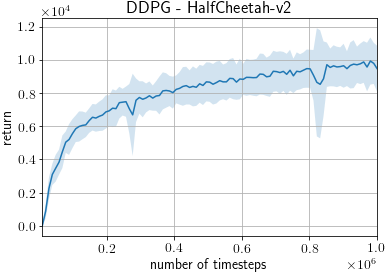
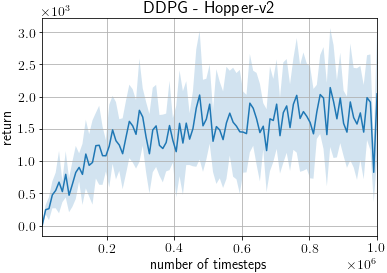
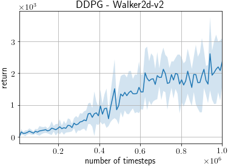
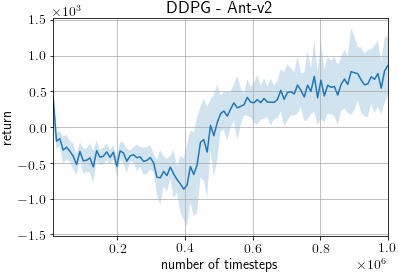
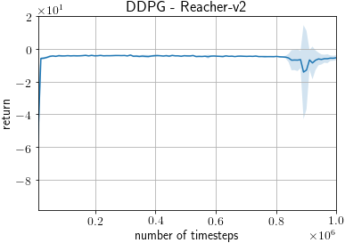
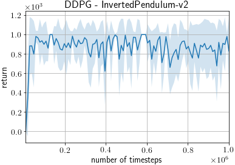
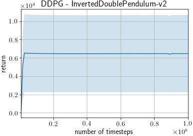

# DDPG on MuJoCo benchmarks

This example trains a DDPG agent ([Continuous Control with Deep Reinforcement Learning](https://arxiv.org/abs/1509.02971)) on MuJoCo benchmarks from OpenAI Gym.

We follow the training and evaluation settings of [Addressing Function Approximation Error in Actor-Critic Methods](http://arxiv.org/abs/1802.09477), which provides thorough, highly tuned benchmark results.

## Requirements

- MuJoCo Pro 1.5
- mujoco_py>=1.50, <2.1

## Running the Example
To run the training example:
```
python train_ddpg.py [options]
```
We have already pretrained models from this script for all the domains listed in the [results](#Results) section. To load a pretrained model:

```
python train_ddpg.py --demo --load-pretrained --env HalfCheetah-v2 --pretrained-type best --gpu -1
```

### Useful Options

- `--gpu`. Specifies the GPU. If you do not have a GPU on your machine, run the example with the option `--gpu -1`. E.g. `python train_ddpg.py --gpu -1`.
- `--env`. Specifies the environment. E.g. `python train_ddpg.py --env HalfCheetah-v2`.
- `--render`. Add this option to render the states in a GUI window.
- `--seed`. This option specifies the random seed used.
- `--outdir` This option specifies the output directory to which the results are written.
- `--demo`. Runs an evaluation, instead of training the agent.
- `--load-pretrained` Loads the pretrained model. Both `--load` and `--load-pretrained` cannot be used together.
- `--pretrained-type`. Either `best` (the best intermediate network during training) or `final` (the final network after training).


To view the full list of options, either view the code or run the example with the `--help` option.


## Results

PFRL scores are based on 10 trials using different random seeds, using the following command.

```
python train_ddpg.py --seed [0-9] --env [env]
```

During each trial, the agent is trained for 1M timesteps and evaluated after every 5000 timesteps, resulting in 200 evaluations.
Each evaluation reports average return over 10 episodes without exploration noise.

### Max Average Return

Maximum evaluation scores, averaged over 10 trials, are reported for each environment.

Reported scores are taken from the "Our DDPG" column of Table 1 of [Addressing Function Approximation Error in Actor-Critic Methods](http://arxiv.org/abs/1802.09477).

| Environment               | PFRL Score   | Reported Score |
| ------------------------- |:------------:|:--------------:|
| HalfCheetah-v2            | **10262.97** |        8577.29 |
| Hopper-v2                 |  **3521.07** |        1860.02 |
| Walker2d-v2               |  **3932.74** |        3098.11 |
| Ant-v2                    |  **1532.35** |         888.77 |
| Reacher-v2                |    **-2.97** |          -4.01 |
| InvertedPendulum-v2       |      1000.00 |        1000.00 |
| InvertedDoublePendulum-v2 |      6558.32 |    **8369.95** |


### Last 100 Average Return

Average return of last 10 evaluation scores, averaged over 10 trials, are reported for each environment.

Reported scores are taken from the "AHE" row of Table 2 of [Addressing Function Approximation Error in Actor-Critic Methods](http://arxiv.org/abs/1802.09477).

| Environment               | PFRL Score  | Reported Score |
| ------------------------- |:-----------:|:--------------:|
| HalfCheetah-v2            | **9750.57** |        8401.02 |
| Hopper-v2                 | **1577.20** |        1061.77 |
| Walker2d-v2               |     2098.46 |    **2362.13** |
| Ant-v2                    |  **753.00** |         564.07 |
| Reacher-v2                |       -5.64 |            N/A |
| InvertedPendulum-v2       |      844.17 |            N/A |
| InvertedDoublePendulum-v2 |     6464.58 |            N/A |

### Training times

These training times were obtained by running `train_ddpg.py` on a single CPU and a single GPU.


| Game                   | PFRL Time (hours) |
| ---------------------- |:-----------------:|
| Ant                    | 3.27              |
| HalfCheetah            | 3.09              |
| Hopper                 | 3.12              |
| InvertedDoublePendulum | 3.40              |
| InvertedPendulum       | 2.84              |
| Reacher                | 3.10              |
| Walker2d               | 3.19              |

### Learning Curves

The shaded region represents a standard deviation of the average evaluation over 10 trials.








